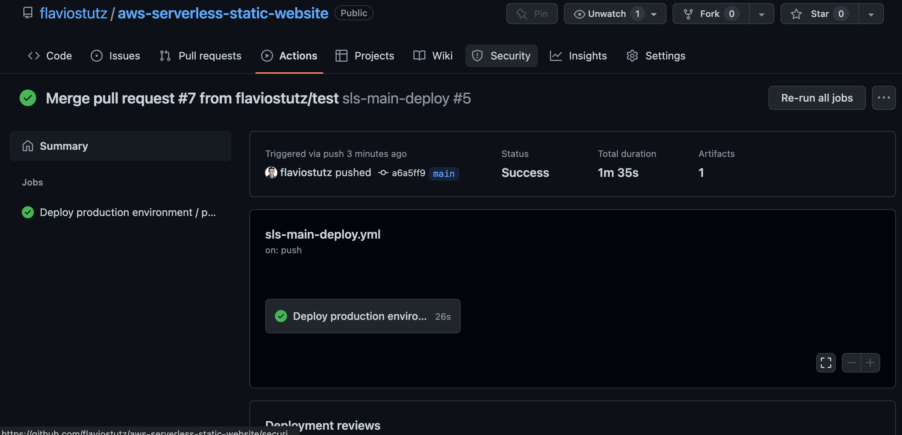

**This repo is deprecated in favor of https://github.com/flaviostutz/gh-makefile**

# github-actions-serverless

This repo contains a set of github actions workflows for common build, test, check and deploy services with Serverless Framework

For a complete example on how to use it, check https://github.com/flaviostutz/aws-serverless-static-website, specifically looking at the files at .github/workflows

Another good monorepo example can be found at https://github.com/flaviostutz/aws-serverless-monorepo-demo

Watch a demo video below:

[](https://youtu.be/oe222JeSOsY)

## Usage

* Create a file on the repository of your project at .github/workflows with the workflow definitions, and make it use the workflow from this repo

```yml
name: sls-pr-deploy

on:
  pull_request:

jobs:
  sls-pr-deploy:
    name: Deploy PR environment
    uses: flaviostutz/gh-workflows-serverless/.github/workflows/sls-deploy.yml@main
    with:
      stage: pr${{ github.event.number }}
      workdir: ./
      AWS_DEFAULT_REGION: us-east-1
    secrets:
      AWS_ACCESS_KEY_ID: ${{ secrets.AWS_ACCESS_KEY_ID }}
      AWS_SECRET_ACCESS_KEY: ${{ secrets.AWS_SECRET_ACCESS_KEY }}
```

* Create secrets "AWS_ACCESS_KEY_ID" and "AWS_SECRET_ACCESS_KEY" pointing to a key with permissions to deploy resources in your AWS account

* Create a branch, push it, then create PR

* Check in tab "Actions" of this task running and see log results

## Configuration

* In your workflow, use
```uses: flaviostutz/gh-workflows-serverless/.github/workflows/sls-deploy.yml@main```
```uses: flaviostutz/gh-workflows-serverless/.github/workflows/sls-remove.yml@main```

### package.json required scripts

```json
    "lint": "eslint",
    "test": "jest",
    "sls:package": "sls package",
    "sls:deploy": "sls deploy",
    "sls:remove": "sls remove"
```

### package.json optional scripts

```json
    "info": "echo 'anything here you want to show in ci log here'"
    "test:integration": "jest --config jest.config.integration.js"
    "sls:print": "sls print",
```

* *test:integration* - script that will be run after deploying the stack for doing integration tests

* *sls:print* - if the default output of deploy doesn't contain a base service URL (for example, if the deployment doesn't have an API gateway), you might want to indicate what is the environment-url (set in GH action) by printing the processed serverless.yml file (with command sls print). Create a "environment-url" in output section that will be gotten by the pipeline. See an example at https://github.com/flaviostutz/aws-serverless-static-website.

serverless.yml

```yml
outputs:
  # used by pipeline to set environment url in GH 
  environment-url: http://${param:siteName}

```


Change these at will

For skipping test, for example, use something like
```"test": "echo \"no tests. ignoring\" && exit 0"```

### Workflow inputs

* workdir: base dir used during builds. If using monorepo, specify the relative path of the service folder. ex.: ./services/example1'
* stage: "stage" used on sls operations as parameter --stage
* artifact-retention: Number of days for retaining the generated artifact. Defaults to 3.
* deploy: Whetever to run package "deploy" or not. You need to specify AWS keys as secret then.
* environment: Github environment to attach this job to
* environment-url: Value to set as environment URL
* AWS_DEFAULT_REGION: The AWS region to deploy resources to

### Workflow secrets

* AWS_ACCESS_KEY_ID: AWS Access Key ID with permission to deploy resources
* AWS_SECRET_ACCESS_KEY:AWS Secret Access Key

### GH Environment URL

* This workflow will do a best effort to get a environment URL, in this order:
  * If a value is set as workflow input in 'environment-url', use it
  * If you have the script 'sls:print' in your package.json and it returns an output as "environment-url: URL", use this value

    In your serverless.yml

    ```yml
    ...
    outputs:
      # used by pipeline to set environment url in GH
      environment-url: http://${param:siteName}
    ```

    In your package.json, add script "sls:print": "sls print"

  * If the result of the command 'sls deploy' returns an URL, which is common when deploying an API, use the first URL found

  * The environment url will be exposed via environment variable "BASE_URL" to your tests when running integration tests. Integration tests are automatically run, by default, if you have a script named "test:integration" in your package.json file.

## More examples

### https://github.com/flaviostutz/aws-serverless-static-website

In this example, we have a complete lifecycle of:

* deployment of an environment when a PR is opened
* removal of the PR environment when it is closed
* deployment of the production environment when something is merged into "main" branch


